# 0710

http://10.11.18.191/#/room/recommend_index
人力精准管理

统计各菜单的功能 汇总一个最全面的菜单和功能 产出excel表

将各租户的菜单与最全面的对比

将各租户缺少的通过其他菜单有的url添加上去

租户改完至cep 

# 0711

对照 人力精准管理.xlsx 进行菜单维护，租户改完

顺序点击每个菜单查找问题

记录报错和没数据的菜单 生成excel表

# 0712

开发任务

增加功能 点击显示的数量 筛选出符合要求的数据形成表格

配置环境与项目

# 0715

配置项目 进行开发

完成系统的配置，运行系统

开始开发要求的功能

# 0716

**前端**

先修改前端，使其能成功传给后端表格该行的几个参数，用 Json格式返回

`getWeekDelayList()`方法改为post来传递参数，由于数量过多不适合用get放在url中

用`name`+`params`的方式传递参数，`name`用来标识，`params`用来传递参数

`router`中修改路由信息，用上述`name`定位

在`getWeekDelayList()`中用`queryParams`来传递给后端变量信息，在methods和create中初始化和传递这些变量

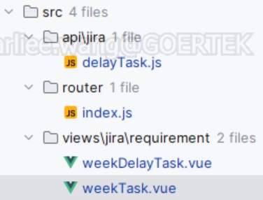

**后端**

按如下图修改

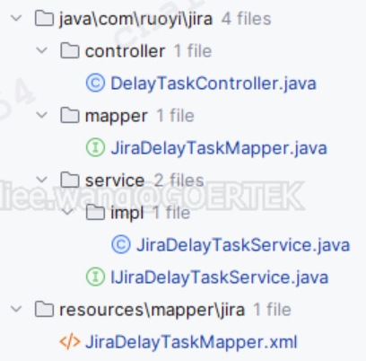

`controller`中将getMapping改为RequestMapping，用post方法

最终在Mapper.xml中新添加一个方法，由于不知道上一个方法是否影响之前的内容，盲目修改可能导致不知道bug，所以直接增加。

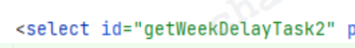
方法和getWeekDelayTask类似，主要加了两个筛选条件，来实现对这一行的定位

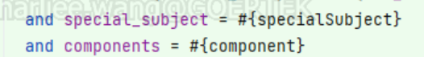

第一列开发成功

# 0717

**需求**

1. 第二列开发

2. 把jira号也加上

**第二列开发**

同day5所做，上午完成

下午更改了表格内容加了 三行必要信息

修改了查询操作，使超链接的数字与点进页面内的内容行数相同

# 0722

完成了下面两个表的根据参数

项目需求分布，修改其他项目点击进去的内容与gmes1+3相同，改get方法为post传递参数，用path传递表示在url中。

# 0723

左边by部门 右边by项目

延期里面加一列模块

延期任务明细导出。 通过若依框架实现前后端导出。

本周计划与下周计划加上默认日期，点击有一个默认日期。实现查找！！

表格上面加上数字

项目年度需求趋势 最近一年（疑似默认就是一年

项目需求分布 筛选 解决方案：删除项目需求分布搜索框，没必要

# 0724

完成了`项目需求分布 数据下算 点击数字可以跳转`的前端部分开发

通过新建一个页面 与 post 请求 结合带参跳转的 name 和 params 方法

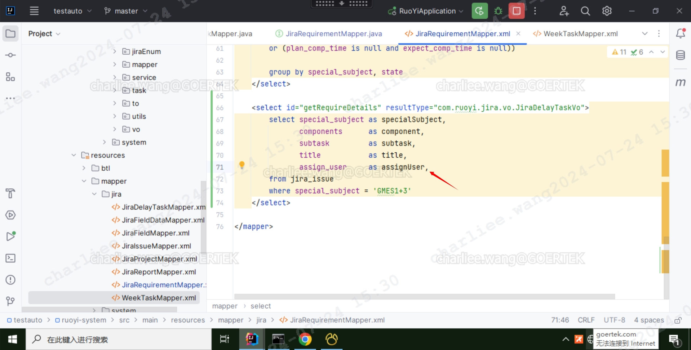

注意`select`后面无逗号，否则sql报错

实现 首页中 项目需求分布 数据下算 点击数字可以跳转

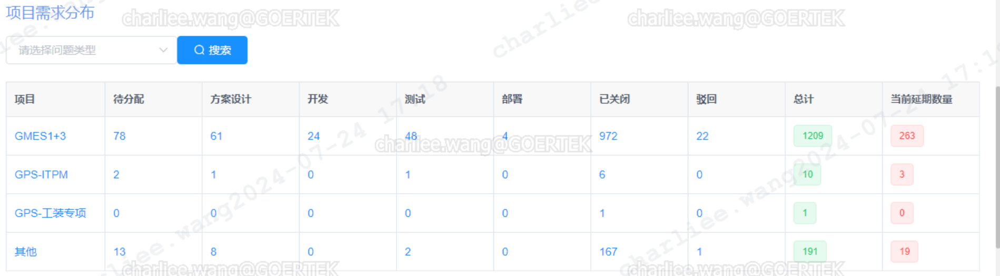

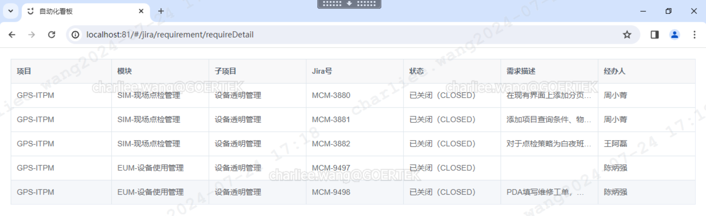

# 0725

实现二级页面的数据下算，能够查找各类状态的任务，但是也不能搜索后再查找。

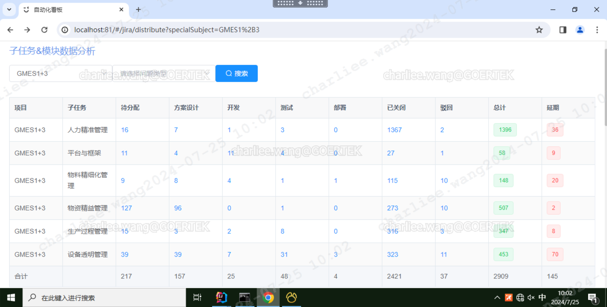

# 0726

交接任务

合并发布

本周实际进度一-改为本周关闭

# 0801

# 0806

1. 个人精力占比显示：上周SR数量，本月周度平均；8R数量导入获取
2. 本周进度 下周计划 延期任务，将待办事项纳入到三个里面
3. 待发布（UAT测试通过）、待验证（缺陷中 已解决 任务new 子任务已发布）
4. 待分配去掉延期任务
5. 开发状态没数据
   缺陷中：
   待处理（NEW）挂起
   一一-待分配
   重新打开、已打开、子任务处理中——-开发
   驳回一驳回
   已解决----待验证
   已关闭--己关闭
6. 删除jira任务后在去同步数据
7. 点击jira号跳转到jira页面

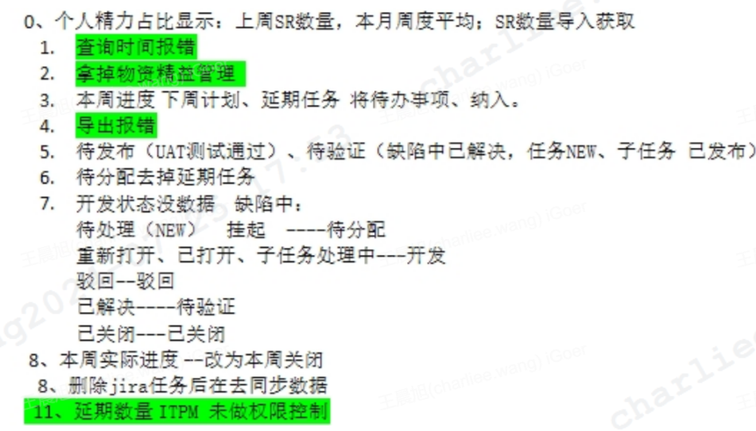
以上人两个延期

其他人一个

下面两个总计的下算

# 0806

子任务&模块数据分析 延期任务去掉待办事项

检查已关闭

个人精力 增加延期数据（任务new 、子任务、缺陷、待办任务）

总计完成下算

延期数量分析+期望完成时间和延期时长

# 0807

个人精力 增加延期数据（任务new 、子任务、缺陷、待办任务）

# 0812

调岗申请权限

修bug

# 0813

在个人精力占比，加一列。叫计划达成率 就是规定时间完成的数量比总数量
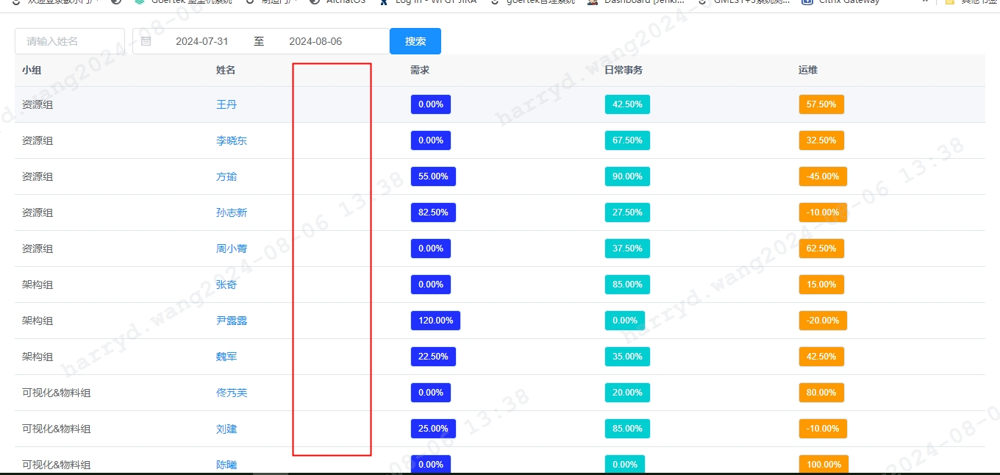
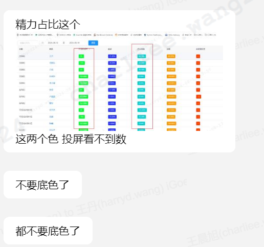
返回保留日期

本周实际进度 改为 本周关闭

# 0814

新增本周进行中 不是关闭和待处理都是进行中 待处理也放到进行中

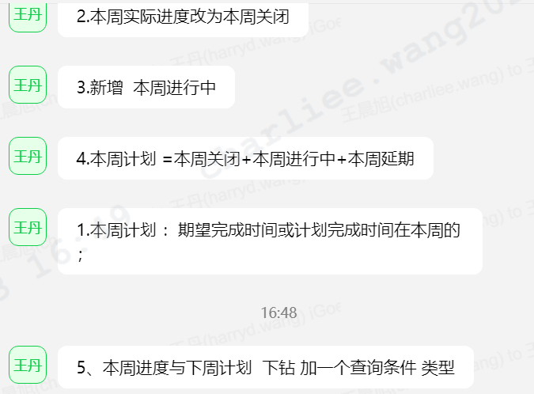
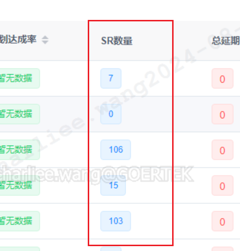

# 0816

本月SR周平均

1.延期任务  加查询条件  经办人 

 2.子页面  延期任务放到最下    本周进度与下周计划往上提

 3.
增加 待办任务明细 报表：
找出是GMES 下平台与框架 且 责任人是毛万平的数据
页面展示：项目，待处理，进行中，已关闭，已延期。
支持下钻到明细数据    

4.本周进度与下周计划   增加 模块查询条件  模块单选框勾选 页面加载模块，默认不勾选 不加载数据

# 0820

5.子页面  增加BG查询，将项目改成BG查询

SR数量字段：变成计划/实际，计划由运维占比转换，按照5天10个SR标准转换，取上周的数据

延期任务：包含当前状态的任务，任务New作为需求负责人的延期也属于功能；

# 0821

1.制造六部JIRA延期任务清单，剩余处理时间，带上 剩余处理时间 小的放前面。
以下数据为JIRA分析平台发送的即将一天内延期或已延期任务，请各位重点关注延期任务，确保正常交付：

# 0822

邮件发布

4.个人精力占比详请 带出任务状态

5.缺陷已解决 计划完成时间=期望完成时间

2.增加一列 经办人，取现有负责人的数据。  责任人 取缺陷是缺陷修复人   任务NEW 子任务取需求负责人

# 0823

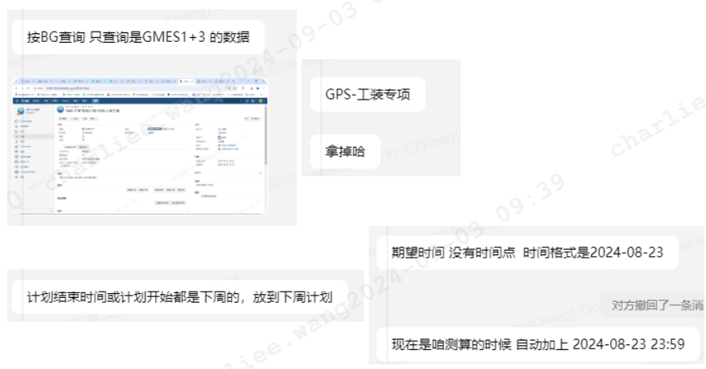

# 以后

2.个人精力占比 增加总任务数   ，当前经办人是当前人的所有的任务 缺陷、需求、代办任务

3.计划达成下钻，带出实际完成时间。

7.bg查找旁边加一个按子模块查找

个人精力页面改善：

- 顶端加一个合计：看出功能组整体状况；

- 需求占比：IMS组的需求没有展示
- 计划达成率：新增下钻，明细清单（看出延期）；

个人精力：分月度和周度两个页面，默认周度，分月度计划，上月进度/周度计划，上周进度。

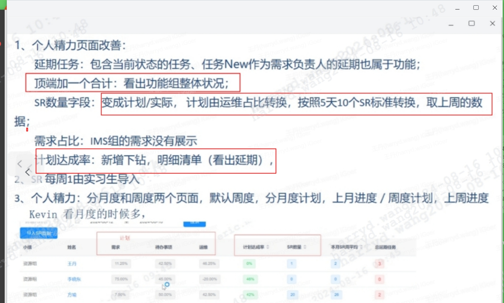
# 0826

G-SMS问题
这个G-SMS取的是另一个字段，在Jira系统中与常规项目名称不是一个字段，而我们数据库中没有这个字段，没必要为了一条数据单独将所有Jira数据的这个字段取出来，可以直接将类型为其他的排除或者手动排除这条数据。

MCM-5665
已解决

运维占比\*day\*8\*(10/8)

0.25* 40/(8/10) SR

# 0827

计划达成率： 按状态的计划完成时间，抓上周

本周需求  本周待办 本周运维  上周计划达成率   上周SR数量（计划/实际）  最近一月SR周平均   总延期任务   进行中任务

字段名称  加问号  进行逻辑说明

week plan task detail加上日期选择器

个人精力占比 加合计 顶上

# 0828

待办合计下算

周度/月度报表

本月需求  本月待办 本月运维  上月计划达成率   上月SR数量（计划/实际）   总累计SR数量  总延期任务   进行中任务

挂起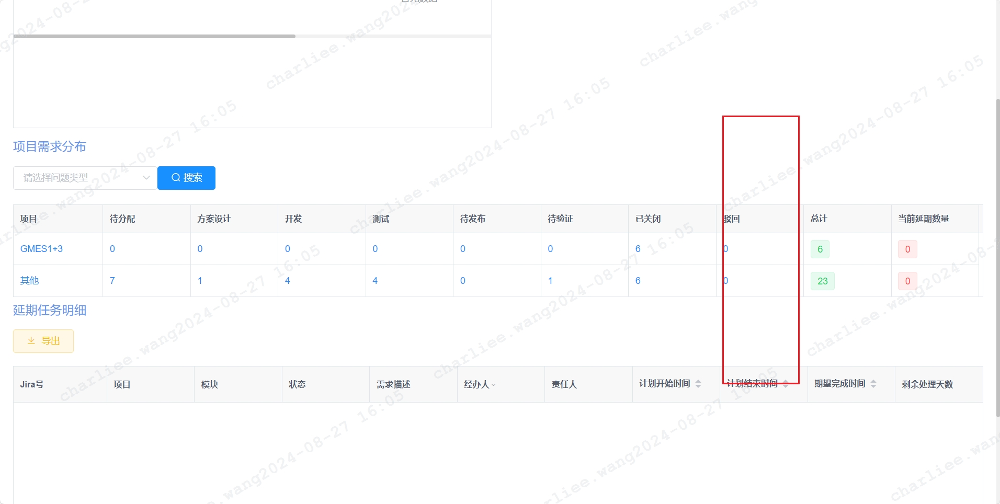

下周待安排 待处理 期望完成时间在下周的or为空     
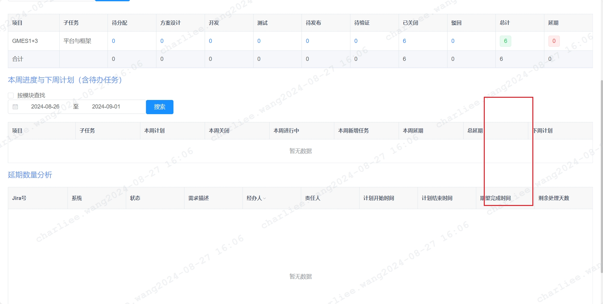
# 0829

查出原来内层界面的延期不带待办事项 修复

本周待安排(带单位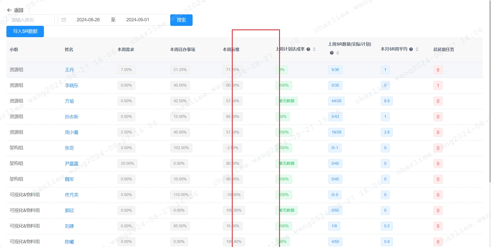

# 0830

数据库sql优化

内层加挂起

月度展示在最前面

# 0

router控制哪个路径渲染哪个页面

api控制页面中的方法调用后端哪个接口

# 0902

0830改了月度

是否按计划达成 标题待安排

生产计划达成率  下钻  ，加一个实际时间字段

新增没这么多  核对下需求+缺陷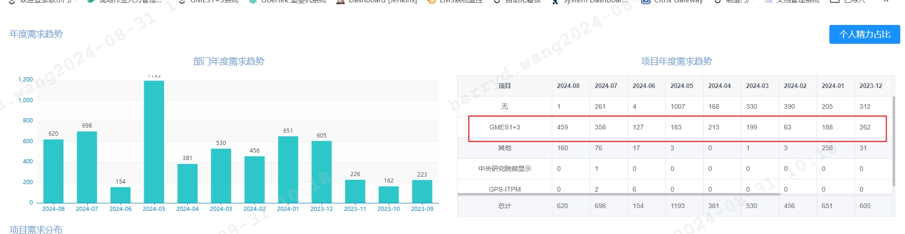

点击跳转页面，1、要么新打开一个窗口，或者返回能直接回到刚开始操作的页面，不重新刷新，不然选了的日期还得重新选。 适用所有的下钻，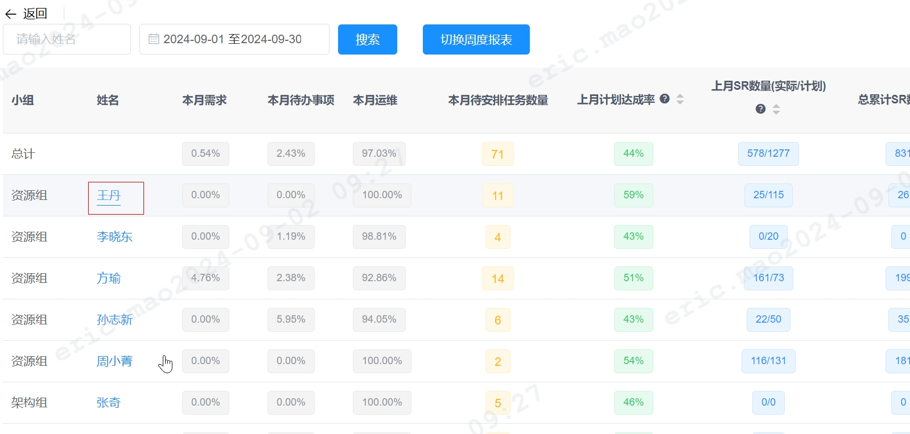

个人精力占比：王爱平 也加入IMS组

本周任务与下周计划加时长

# 0903

# Demands

1. 按模块查询
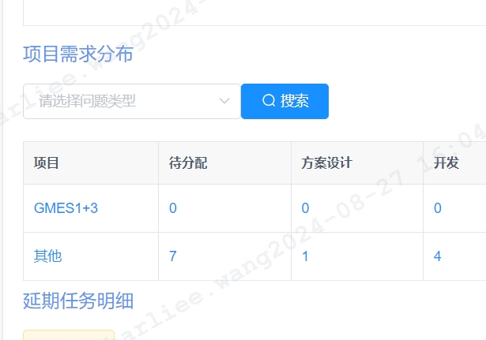
2. 本周进度和下周计划  待办 加筛选 筛选出含待办和不含待办的任务

3. 年度趋势分析 点项目下钻   展示趋势  趋势范围：每月和往前滚动4周两个趋势图
   分任务NEW 和缺陷 用单选框4合2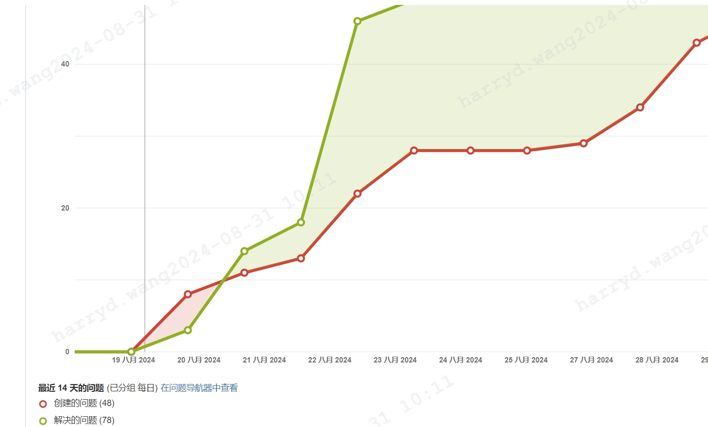
4. 数据筛选：缺陷/需求/待办    可多选  --缺陷（ Bug）        维度分析： 按BG查找 ； 按系统查找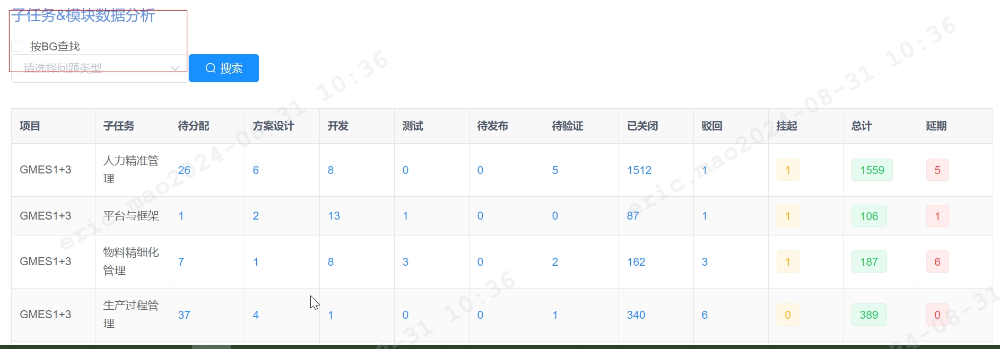

# 项目总体图

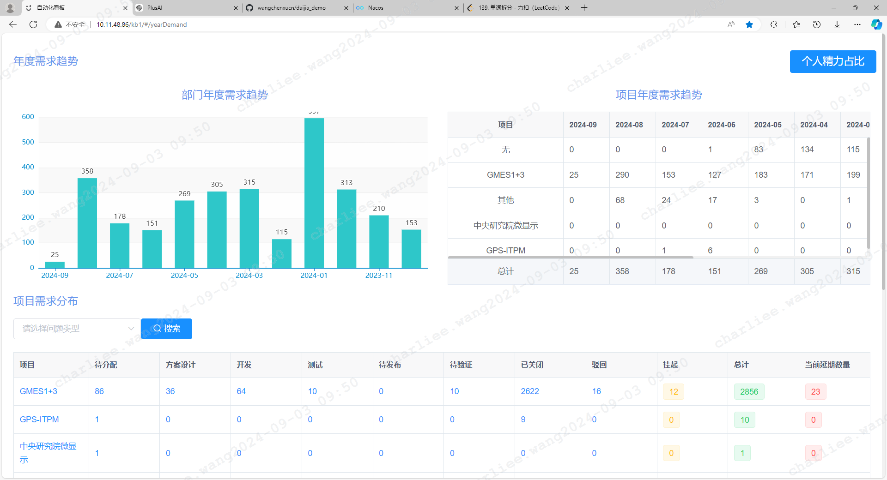
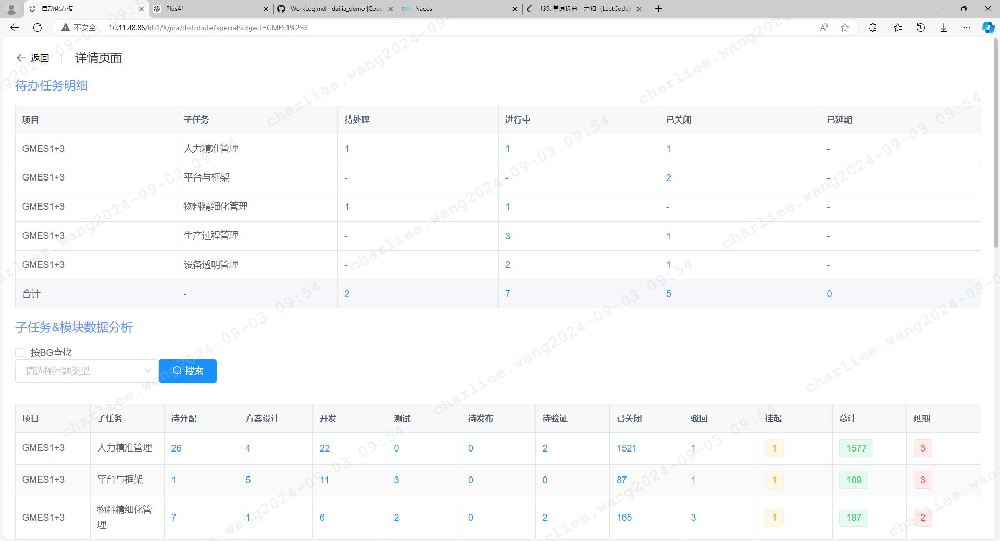
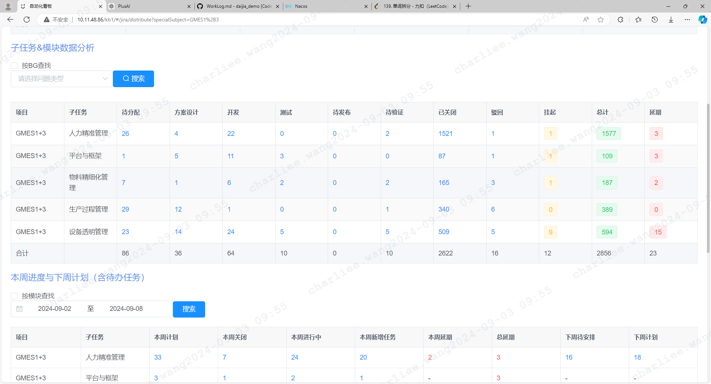
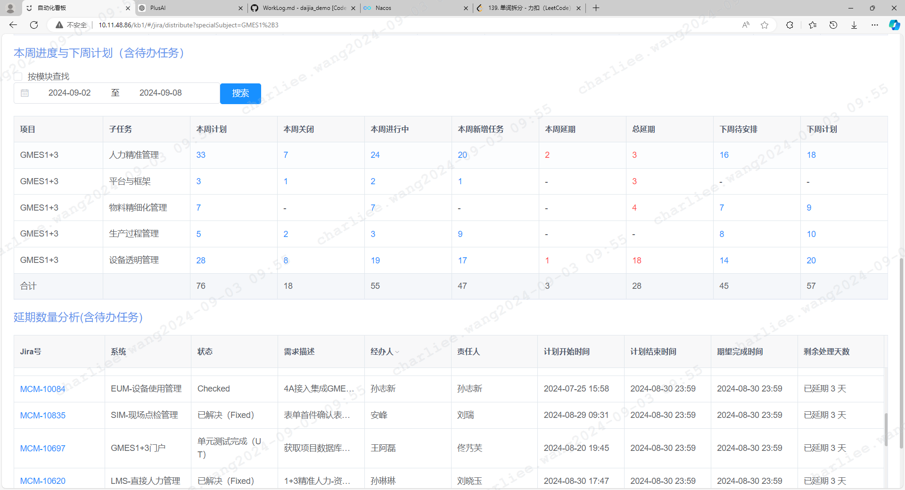
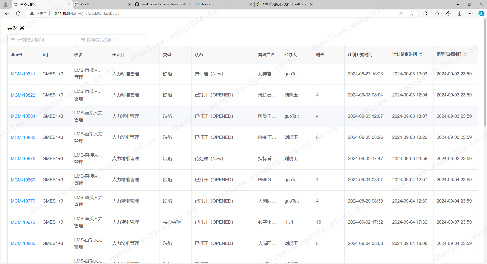
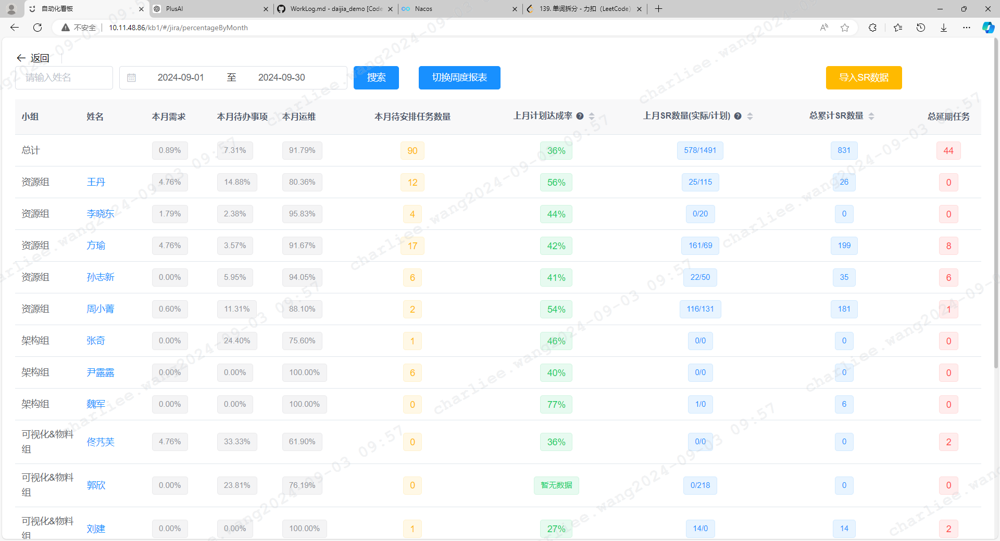
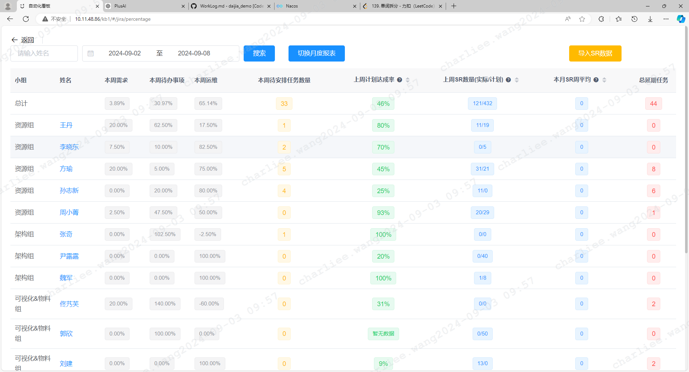
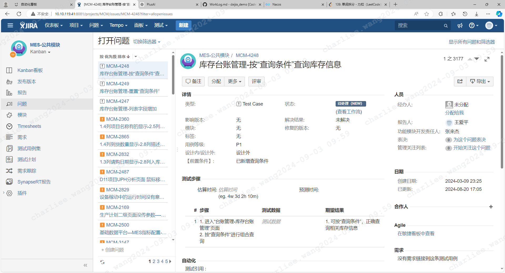